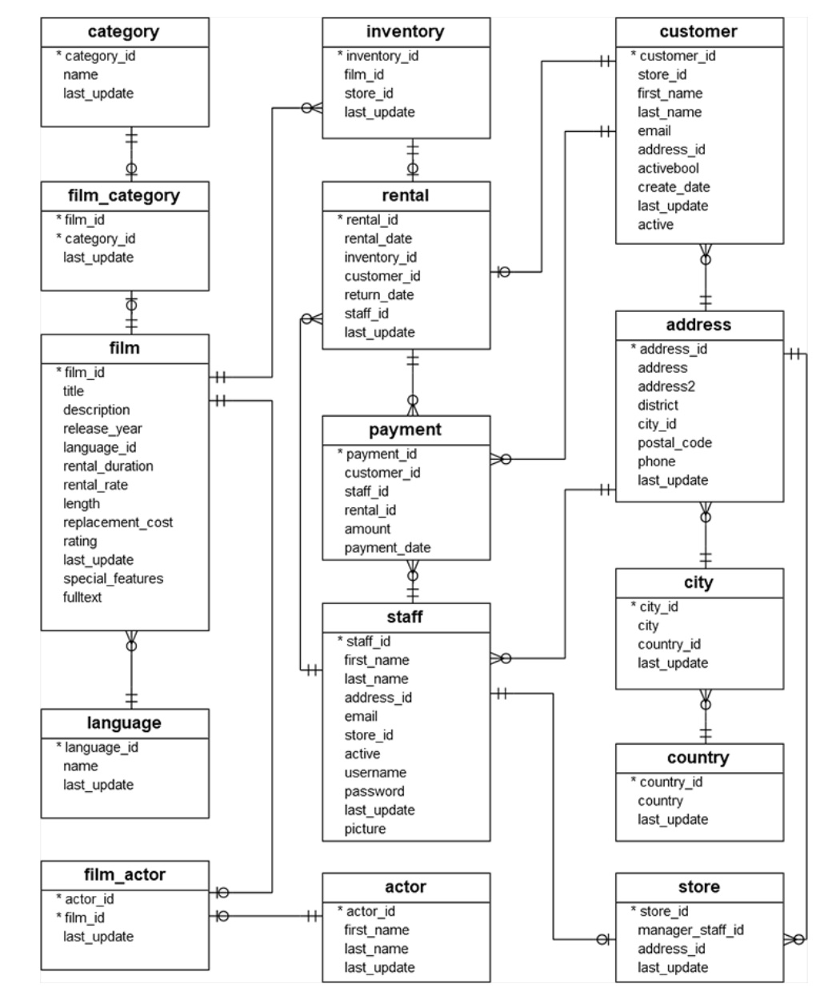

# Prueba Final Modulo 5 - Bases De Datos con PostgreSQL.

## Proyecto 🚀

Este proyecto corresponde a la prueba final del módulo 5 - Base de datos con PostgreSQL, para el bootcamp **"Desarrollo de Aplicaciones Full Stack JavaScript Trainee V2.0 Vespertino"**

## Ejercicio Propuesto

1. Descarga el archivo ["dvdrental.zip"](./assets/files/dvdrental.zip). adjunto y descomprima para obtener el archivo dvdrental.tar.
2. La base de datos "dvdrental" contiene 15 tablas bajo el siguiente modelo relacional.



3. Construye las siguientes consultas:

- Aquellas usadas para insertar, modificar y eliminar un Customer, Staff y Actor.
- Listar todas las “rental” con los datos del “customer” dado un año y mes.
- Listar Número, Fecha (payment_date) y Total (amount) de todas las “payment”.
- Listar todas las “film” del año 2006 que contengan un (rental_rate) mayor a 4.0.

4. Realiza un Diccionario de datos que contenga el nombre de las tablas y columnas, si éstas pueden ser nulas, y su tipo de dato correspondiente.

## Procedimiento 📋

### 1. Importar archivos.

- Crear base de datos donde se importaran los datos.

```sql
CREATE DATABASE dvdrental;
```

```psql
\c dvdrental
```

Output: `You are now connected to database "dvdrental" as user "postgres".`

- Importar datos desde archivo `restore.sql` a base de datos `dvdrental`. En mi caso utilicé Docker y sincronicé el archivo dvdrental.tar dentro del contenedor mediante un volumen, el resto del procedimiento es similar a importar desde Linux (tambien se puede hacer ejecutando el comando sin entrar al contenedor, pero preferí este modo).

```bash
# Ingresar al contenedor mediante terminal:
docker exec -it my-pg-container /bin/bash
```

```bash
# Realizar import con psql:
pg_restore -U postgres -d dvdrental -v /home/dvdrental.tar
```

### 2. Tablas insertadas.

```psql
/dt
```

Output:

```psql
             List of relations
 Schema |     Name      | Type  |  Owner
--------+---------------+-------+----------
 public | actor         | table | postgres
 public | address       | table | postgres
 public | category      | table | postgres
 public | city          | table | postgres
 public | country       | table | postgres
 public | customer      | table | postgres
 public | film          | table | postgres
 public | film_actor    | table | postgres
 public | film_category | table | postgres
 public | inventory     | table | postgres
 public | language      | table | postgres
 public | payment       | table | postgres
 public | rental        | table | postgres
 public | staff         | table | postgres
 public | store         | table | postgres
(15 rows)
```

### 3. Construye las siguientes consultas:

**Aquellas usadas para insertar, modificar y eliminar un Customer, Staff y Actor.**

CUSTOMER:

- Ingresar un nuevo customer:

```sql
INSERT INTO customer(store_id, first_name, last_name, email, address_id, active)
VALUES (1, 'Jhon', 'Doe', 'john.doe@sakilacustomer.org', 469, 1);
```

Output: `600	1	Jhon	Doe	john.doe@sakilacustomer.org	469	t	2023-06-06	2023-06-06 16:36:03.469491	1`

- Actualizar el último registro de customer:

```sql
UPDATE customer
SET first_name = 'Victor', last_name = 'Araya', email = 'victor.araya@sakilacustomer.org', address_id = 49
WHERE customer_id = 600;
```

Output: `600	1	Victor	Araya	victor.araya@sakilacustomer.org	49	t	2023-06-06	2023-06-06 17:05:34.826646	1`

- Eliminar el último registro ingresado en customer y reiniciar secuencia.

```sql
DELETE FROM customer WHERE customer_id = 600;
ALTER SEQUENCE customer_customer_id_seq RESTART WITH 600;
```

Output `> Affected rows: 1, > OK`

STAFF:

- Ingresar un nuevo staff:

```sql
INSERT INTO staff
(first_name, last_name, address_id, email, store_id, username, password)
VALUES
('Lance', 'Knott', 5, 'lance.knott@sakilastaff.com', 1, 'Lance', MD5('userPassword'))
```

Output: `3	Lance	Knott	5	lance.knott@sakilastaff.com	1	t	Lance	221068207e125b97beb4e2d062e888b1	2023-06-06 18:09:34.202452`

- Actualizar dirección de último registro de staff:

```sql
UPDATE staff SET email = 'Lance.Knott@sakilastaff.com', address_id = 6
WHERE staff_id = 3;
```

Output: `3	Lance	Knott	6	Lance.Knott@sakilastaff.com	1	t	Lance	221068207e125b97beb4e2d062e888b1	2023-06-06 18:12:32.543852`

- Eliminar el último registro ingresado en staff y reiniciar secuencia.

```sql
DELETE FROM staff WHERE staff_id = 3;
ALTER SEQUENCE staff_staff_id_seq RESTART WITH 3;
```

Output `> Affected rows: 1, > OK`

ACTOR:

- Ingresar un nuevo actor:

```sql
INSERT INTO actor(first_name, last_name) VALUES ('Jhonny', 'Deep');
```

Output: `201	Jhonny	Deep	2023-06-06 18:30:27.269484`

- Cambiar Actor:

```sql
UPDATE actor SET first_name = 'Keanu', last_name = 'Reeves'
WHERE actor_id = 201;
```

Output: `201	Keanu	Reeves	2023-06-06 18:35:44.375893`

- Eliminar el último registro ingresado en staff y reiniciar secuencia.

```sql
DELETE FROM actor WHERE actor_id = 201;
ALTER SEQUENCE actor_actor_id_seq RESTART WITH 201;
```

Output `> Affected rows: 1, > OK`

**Listar todas las "rental" con los datos del "customer" dado un año y mes.**

```sql
SELECT re.*, cu.* FROM rental re
JOIN customer cu ON re.customer_id = cu.customer_id
WHERE EXTRACT(YEAR FROM re.rental_date) = 2005
AND EXTRACT(MONTH FROM re.rental_date) = 5
ORDER BY rental_date DESC;
```

Output: `1156 records`

**Listar Número, Fecha (payment_date) y Total (amount) de todas las "payment".**

```sql
SELECT payment_id AS numero,
payment_date AS fecha,
amount AS total
FROM payment
GROUP BY payment_id, payment_date;
```

Output: `14595 records`

**Listar todas las "film" del año 2006 que contengan un (rental_rate) mayor a 4.0.**

```sql
SELECT * FROM film WHERE release_year = 2006 AND rental_rate > 4.0;
```

Output: `336 records`

### 4. Realiza un Diccionario de datos que contenga el nombre de las tablas y columnas, si éstas pueden ser nulas, y su tipo de dato correspondiente.

```sql
SELECT
   table_name AS nombre_tabla,
   column_name AS nombre_columna,
   udt_name AS tipo_dato,
   character_maximum_length AS largo,
   is_nullable AS es_null,
   column_default AS defecto
FROM
   information_schema.columns
WHERE
    table_schema = 'public'
ORDER BY nombre_tabla;
```

Output:

```
"actor"	"last_update"	"timestamp"		"NO"	"now()"
"actor"	"first_name"	"varchar"	45	"NO"
"actor"	"actor_id"	   "int4"		   "NO"	"nextval('actor_actor_id_seq'::regclass)"
... ...
128 records
```

Diccionario de datos con constraints

```sql
/* Lista por tabla (se debe indicar el nombre de la tabla y el schema),
obtiene las constraints, ideal para ver en detalle cada tabla. */
SELECT
    c.column_name AS nombre_columna,
    c.data_type AS tipo_dato,
    c.character_maximum_length AS largo,
	 tc.constraint_type AS tipo_constraint,
    c.is_nullable AS es_null,
    c.column_default AS defecto
FROM
    information_schema.columns c
LEFT JOIN (
    SELECT ccu.column_name, tc.constraint_type
    FROM information_schema.constraint_column_usage ccu
    JOIN information_schema.table_constraints tc
	ON ccu.constraint_name = tc.constraint_name AND ccu.table_schema = tc.table_schema
    WHERE tc.table_name = 'payment' AND tc.table_schema = 'public'
) tc
ON c.column_name = tc.column_name
WHERE c.table_name = 'payment' AND c.table_schema = 'public';
```

Output:

```
"payment_id"	"integer"		"PRIMARY KEY"	"NO"	"nextval('payment_payment_id_seq'::regclass)"
"customer_id"	"smallint"		"FOREIGN KEY"	"NO"
... ...
6 records
```

- Ver [diccionario de datos](./assets/files/dd_dvdrental.pdf) completo.

## Recursos 📌

En este proyecto se utilizó, terminal (BASH / ZSH), Docker, PGAdmin, PostreSQL, VSCode.

Adicionalmente, se consumieron recursos externos:

- [PostgreSQL Docs V15](https://www.postgresql.org/docs/)
- Documentación de clases.

---

Codeado(⌨️) con ❤️ por **Víctor Araya**
